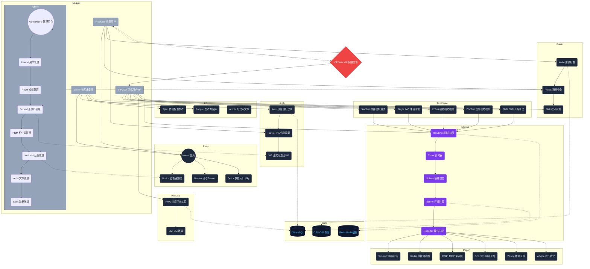
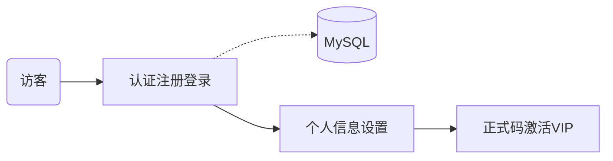
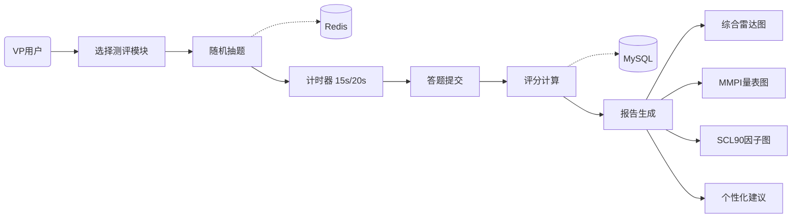
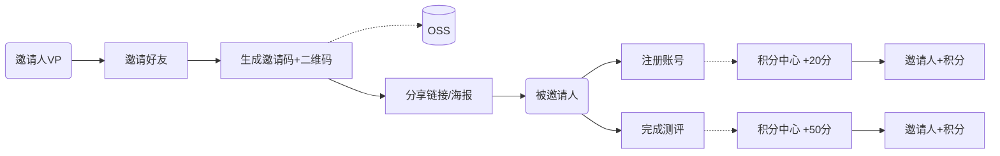
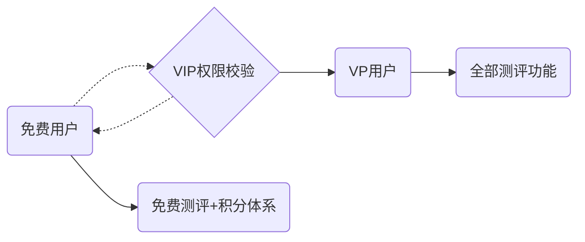
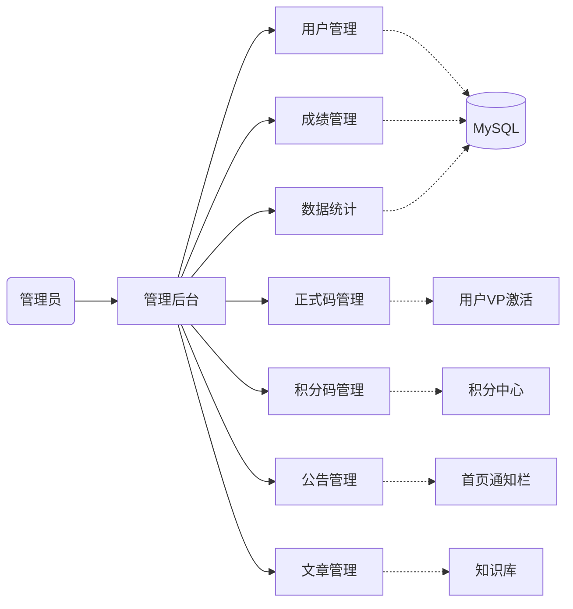
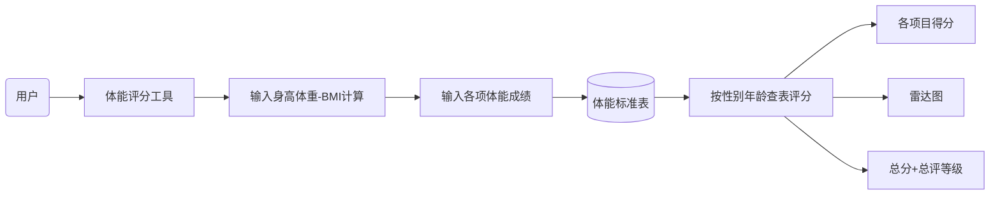

# 五维测评系统 - 用户功能模块交互图

> Mermaid 交互图，建议在 Typora / 飞书 / Notion / VS Code 中渲染查看

---

## 一、总览图

---

## 二，子流程图

### 流程1：用户登录注册

### 流程2：测评完整流程

### 流程3：邀请裂变体系

### 流程4：VIP权限控制

### 流程5：管理员运营体系

### 流程6：体能评分流程

---

## 三、图例

| 图形 | 含义 |
|---|---|
| 箭头 --> | 正常数据流向 / 模块跳转 |
| 虚线 -.-> | 条件触发 / 权限校验 / 存储操作 |
| 六边形 | 权限分支节点 |
| 圆柱 | 数据库层 |
| 灰色节点 | 访客（未登录） |
| 蓝色节点 | 免费用户 |
| 绿色节点 | VIP正式用户 |
| 黄色节点 | 管理员 |
| 紫色节点 | 测评执行引擎 |
| 红色节点 | VIP权限判断 |

---

## 四、模块速查表

| 模块分类 | 模块名称 | 访问角色 | 数据依赖 |
|---|---|---|---|
| 首页入口 | 首页 / 公告 / Banner | 全部用户 | MySQL-公告表 |
| 测评中心 | 综合模拟 / 初检 / 役前 / 单项 / SBTI | VIP | MySQL-题库, Redis-缓存 |
| 测评引擎 | 抽题 / 计时 / 评分 / 报告 | VIP | MySQL, Redis |
| 报告系统 | 雷达图 / MMPI / SCL-90 / 错题 | VIP | MySQL-记录表 |
| 体能评分 | 体能工具 / BMI | VIP | MySQL-标准表 |
| 用户体系 | 认证 / 个人信息 / VIP激活 | 全部登录用户 | MySQL-用户表 |
| 积分体系 | 积分中心 / 邀请 / 商城 | 全部登录用户 | MySQL-积分表 |
| 知识库 | 备考方案 / 体检标准 / 文章 | 全部用户 | MySQL-文章表 |
| 管理后台 | 用户 / 成绩 / 码 / 公告 / 统计 | 仅管理员 | MySQL全表 |
| 数据层 | MySQL / Redis / OSS | 全部模块 | - |

---

## 五、角色权限矩阵

| 功能 | 访客 | 免费用户 | VIP用户 | 管理员 |
|---|---|---|---|---|
| 浏览首页 | yes | yes | yes | yes |
| 注册登录 | yes | yes | yes | yes |
| 体检标准参考 | yes | yes | yes | yes |
| 免费40题体验 | yes | yes | yes | yes |
| 部分单项测验 | no | part | yes | yes |
| 综合模拟测试 | no | no | yes | yes |
| 体能评分工具 | no | no | yes | yes |
| 积分邀请体系 | no | yes | yes | yes |
| 查看报告历史 | no | yes | yes | yes |
| 管理后台 | no | no | no | yes |

---

*文档版本：v1.3 | 修复：Mermaid三反引号正确闭合*
